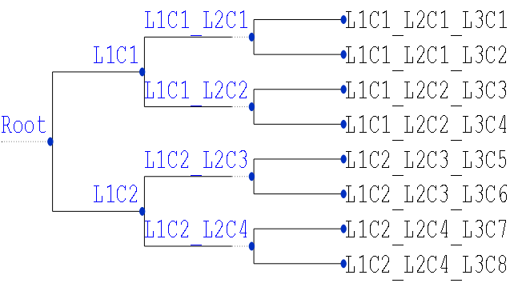

## DCMFlow: A Discrete Choice Model using TensorFlow

DCMFlow is a Python module that estimates the parameters of a *nested logit model* with an arbitrary structure of depth and number of choices. We use the open software library TensorFlow to express the model as a computational graph so that its parameters can be estimated efficiently on CPUs and GPUs using optimizers suitable for small and large datasets. The model is designed to be very simple to build and estimate as shown below. Yet, it provides a flexible approach to express any linear utility function as we will see in this mini-tutorial. ([check below for a summary of features.](#features-in-the-current-version-of-dcmflow))

```python
import DCMFlow as dcm
import pandas as pd
m = dcm.NLFlow(nltree_dict=nltree_dict, utilities_dict=utilities_dict)
data = pd.read_csv('data')
m.fit(data)
# Loglikelihood (Sum/Mean)=105015.7/1.313, T=0s
```

### Two Dictionaries and a Dataframe

These are the number of data structures **required** to build and estimate a nested logit model in DCMFlow. The two dictionaries are to store the tree structure and choice utilities. The Pandas dataframe is to hold the observed data in long format. The following sections provide more details about these data structures.

#### 1. Choice Tree

The choice tree is a dictionary (`dict()`) whose keys are level IDs (e.g., `'l0'`, `'l1'`, `'l2'`, etc.) in the tree and values are the choice IDs (e.g., `'Root'`, `['L1C1', 'L1C2']`) within each level. The naming convention and the order of the IDs for the keys (levels) and choices must adhere to the following simple rules:

1. Key IDs must start with the lower-case letter `l` and followed with an integer number (sequential) that denotes the level/depth of the tree. The numbering must start with 0 (for the `'Root'` level) and continue to the number of levels, or depth, of the tree with increments of 1. The dictionary's keys for a typical 3-level tree must be `'l0'`, `'l1'`, `'l2'`, and `'l3'`.
2. The values in the dictionary must uniquely identify the choices, whether internal or leaf, in the tree. The choices in a particular level in the tree must be provided as a **list of strings**. Each string must be the ID of one choice and as such we call it *Choice ID*. A valid Choice ID must contain the Choice ID of its parent node as a prefix (to identify the hierarchy of the tree) and a suffix that uniquely identifies that choice from all other choices in the same level. For example, the set of choices in the second level of a choice tree (`'l2'`) may look like: `['L1C1_L2C1', 'L1C1_L2C2', 'L1C2_L2C3', 'L1C2_L2C4']`. We apply this naming convention to all choices in all levels *except the zero'th and first levels* due to the presence of `Root`. For these two levels, Choice IDs *MUST NOT* include the parent's Choice IDs and, instead, should be named something like: `'Root'` for `'l0'` and `['L1C1', 'L1C2']` for `'l1'`. 
**Note**: I chose the format `'L(l)C(c)_L(l+1)C(d)'`, as in `'L1C2_L2C3'` above, for convenience and demonstration purposes. They could be replaced by anything else as long as the choice IDs are unique and contain the choice IDs of their immediate parents.     
3. Choice IDs in one level `'l(i)'`, e.g. `'l2'`, must be ordered in a list from left to right according to the order of their parents in the upper level (`'l(i-1)'`, e.g., `'l1'`). Similarly, the choice IDs in the next level, `'l(i+1)'`, must be provided in the same order as their parents in `'l(i)'`. Following the example given in the previous point (2 above), note that Choice IDs in `'l2'` `['L1C1_L2C1', 'L1C1_L2C2', 'L1C2_L2C3', 'L1C2_L2C4']` follow the same order of their parents in `'l1'` `['L1C1', 'L1C2']`. That is, the choices `'L1C1_L2C1'` and `L1C1_L2C2` appeared before `L1C2_L2C3` and `'L1C2_L2C4'` in the list because their immediate parents appear as `['L1C1', 'L1C2']` instead of `['L1C2', 'L1C1']`. We will see later how choices in `'l3'` follow the order of choices in `'l2'`. This rule of choice ordering must be followed for all choices in all levels for deeper trees.

##### Example 1:
```python
# generate a random symmetric nested logit tree with the given structure 
# of [2,2,2]. The first level has two choices, each with two children 
# choices at level 2, the four children at level 2 also have two children
# each at level 3 which makes the total number of choices (leaf nodes) to be 8.
nltree_dict = generate_nltree([2,2,2])

print(nltree_dict)
{'l0': 'Root',
 'l1': ['L1C1', 'L1C2'],
 'l2': ['L1C1_L2C1', 'L1C1_L2C2', 'L1C2_L2C3', 'L1C2_L2C4'],
 'l3': ['L1C1_L2C1_L3C1',
  'L1C1_L2C1_L3C2',
  'L1C1_L2C2_L3C3',
  'L1C1_L2C2_L3C4',
  'L1C2_L2C3_L3C5',
  'L1C2_L2C3_L3C6',
  'L1C2_L2C4_L3C7',
  'L1C2_L2C4_L3C8']}
```

#### 2. Choice Utilities

In addition to the choice tree, DCMFlow expects an *ordered dictionary* of choice utilities. The keys in the utilities' dictionary are the choice IDs of the leaf nodes in the choice tree with one-to-one correspondence. Each choice in the leaf nodes of the tree must be associated with a utility expression, which is the value in the utilities' dictionary. The utility expression of each choice is simply a string of one or more additive terms. The terms are linear functions of model parameters (constants and coefficients) and observed data (covariates). For example, a utility expression for a leaf choice in the tree may look like: `A1 + B1*X1 + A2 + B2*X2`. Another choice may have the following utility: `A3 + B2*X2 + B7*X7`. The utilities' dictionary must be prepared to conform to the following requirements so that it is parsed correctly:

1. The utilities' dictionary must be an ordered dictionary (`orderedDictionary()`). The keys of the dictionary must be the Choice IDs in the lowest level of the tree (`l(n_levels)`). Also, the choices must be ordered according to the order of the choices in the list at the lowest level of the choice tree (left-to-right). For example, if the choice tree has 3 levels where the third level (`l3`) has the following choices: `['L1C1_L2C1_L3C1', 'L1C1_L2C1_L3C2', ..., 'L1C2_L2C4_L3C8']`, the utilities dictionary must be provided with the data in the order shown in the example below.
2. The terms of the utility expression must be separated by plus (`+`) signs. A term could be a constant parameter (e.g., `A1` in the snippet above) or a multiplication of a coefficient parameter and a covariate (e.g., `B1*X1`). In the latter case, the coefficient name (ID) must always appear in the left and the covariate name must be on the right and separated by an asterisk sign (`*`). 
3. The covariate names that appear in all utility expressions must have corresponding column names in the Pandas dataframe that we explain in the following section.
4. You could use coefficients with dummy covariate variables in lieu of constants that depend upon, say, certain categories of decision makers or choices. (*For example, we used this to include a constant for New model year versus Old models. In this case, I added another covariate, say Xnew, whose value is 1 for new model years and 0 for old ones. I then added the term `Bnew*Xnew` to the utilities of choices that belong to the new model year.*)
5. Parameter names (e.g., `A1`, `B1`, etc., above) are extracted (parsed) from the utility expressions and used as identifiers for the model parameters. Any constraints or initial values passed to the model's `fit()` function must reference these parameters by the names used in the utility expressions. We use dictionaries to hold constraints and initial values for parameters as we will see later in the tutorial.   

##### Example 2:
```python
from collections import OrderedDict
utilities_dict = OrderedDict()
utilities_dict['L1C1_L2C1_L3C1'] = 'A1 + B1*X1 + A2 + B2*X2'
utilities_dict['L1C1_L2C1_L3C2'] = 'A3 + B2*X2 + B7*X7'
#... and so on until the last choice
utilities_dict['L1C2_L2C4_L3C8'] = 'A4 + B4*X3 + A9 + B6*X6'
```

#### 3. Observed Data

It's time to use the data you've perhaps spent ages to collect and curate. DCMFlow will require just a few more minutes from your time to prepare it in a way that it understands. The data must be provided as a Pandas Dataframe and prepared in the long, *a.k.a* case-alternative, format where each record contains information about **one case and one choice**. The information in each record must include the following columns:

1. **caseid**: This column must contain unique identifiers of the observed cases or decisions that have been made. It should be noted that any `caseid` must occur at least twice in the data where each occurrence must be for different `choiceid` (explained next), which means that the decision maker had to chose between at least two alternatives. 
2. **choiceid**: This column must contain the Choice IDs of the alternatives that the decision maker had to chose from upon making the decision. They also must (exactly) match the Choice IDs that appear as leaf nodes in the choice tree (i.e., at the lowest level `l(n_levels)`). Note that Choice IDs of unavailable choices must be omitted for the given case. That is, when the decision maker (ID'ed by the value appear in the caseid column) does not observe the unavailable alternatives (for whatever reason, e.g., stock-out), then that those `choiceid's` must not appear for that `caseid`.   
3. **chosen**: This is the third mandatory column in the data. As the name implies, it identifies the choice that the decision maker chose amongst all available choices. The selected choice must have its `chosen` field set to 1, otherwise it is zero. It should be noted that for every `caseid` there must be one and only one selected choice. Therefore, for sanity check, make sure that the outcome of this command is `True`: `sum(data.groupby(['caseid'])['chosen'].sum() != 1) == 0` if the name of your Pandas dataframe is `data`.
4. **covariates**: these columns typically contain information about the choice and/or decision maker. The column names must be unique and correspond to the covariate names given in the utility expressions. The data in these columns must be numerical without any missing information (`nan`). Also, *the covariates should be properly cleaned from outliers and scaled/normalized/standardized to avoid any numerical issues during optimization as our experiments show that parameter estimation usually fails when data is not pre-processed properly.*   

##### Example 3:
| caseid        | choiceid           | chosen  | X1 | X2 | ... | X7 |
| ------------- | :-------------: | :-----: | :-----: | :----: | :----: | :----: |
| case1      | L1C1_L2C1_L3C2 | 0 | 0.23 | 1.04 | ... | 0.57 | 
| case1      | L1C1_L2C2_L3C4      |   1 |  0.43 | 0.99 | ... | 0.59 |
| case1      | L1C1_L2C2_L3C5      |    0 |  0.37 | 0.81 | ... | 0.37 |
| case2      | L1C1_L2C1_L3C1 | 1 | 0.19 | 2.01 | ... | 0.46| 
| case2      | L1C1_L2C2_L3C3      |   0 |  0.50 | 0.79 | ... | 0.77 |
| case2      | L1C1_L2C2_L3C5      |    0 |  0.28 | 0.69 | ... | 0.87 |
| ...      | ...  | ... |  ... | ... | ... | ... |
| case83250      | L1C1_L2C1_L3C1 | 0 | 0.19 | 3.11 | ... | 1.01| 
| case83250      | L1C1_L2C2_L3C4      |   0 |  0.97 | 0.99 | ... | 0.91 |
| case83250      | L1C1_L2C2_L3C7      |    1 |  0.88 | 0.89 | ... | 0.89 |
| case83250      | L1C1_L2C2_L3C8      |    0 |  0.27 | 0.59 | ... | 0.99 |


### Instantiating a Nested Logit Model with DCMFlow

After creating the choice tree and utilities' expressions, the nested logit model can be instantiated using the NLFlow class in the DCMFlow module as follows:
```python
import DCMFlow as dcm
m = dcm.NLFlow(nltree_dict=nltree_dict, utilities_dict=utilities_dict)
m.draw_tree('%inline') # to save it as an image, just pass the file name
```

<p align="center">  </p>

DCMFlow uses the ETE Toolkit to display the tree and therefore the ETE3 python module must be installed first (http://etetoolkit.org/). 
```python
m.print_tree()
#                 /-L1C1_L2C1_L3C1
#        /L1C1_L2C1
#       |         \-L1C1_L2C1_L3C2
#    /L1C1
#   |   |         /-L1C1_L2C2_L3C3
#   |    \L1C1_L2C2
#   |             \-L1C1_L2C2_L3C4
#-Root
#   |             /-L1C2_L2C3_L3C5
#   |    /L1C2_L2C3
#   |   |         \-L1C2_L2C3_L3C6
#    \L1C2
#       |         /-L1C2_L2C4_L3C7
#        \L1C2_L2C4
#                 \-L1C2_L2C4_L3C8
```

### Choice Simulation and Model Estimation

Before estimating the parameters of your choice model on real-world data using DCMFlow, it is recommended that you experiment with it on simulated data to check if you could recover the simulated true parameters. Once you learned  how to use DCMFlow and ensured that your estimates are close enough to the true parameters, you could use the module on real data. In this section, I will show you how to estimate the model on simulated data where the values of the covariates and parameters (logsums, constants, and coefficients) are randomly sampled from normal and uniform distributions. The choices were simulated by NLFlow according to the utility values of the alternatives which themselves are linear functions of the random parameters and covariates. NLFlow uses these utilities to compute probabilities and then for each caseid it randomly draws one alternative from available choices according to their multinomial distribution. The function `compute_choices_and_likelihood()` performs these calculations and returns the simulated choices when provided with the simulated parameters and data (*in the format explained above, but need not contain the `chosen` column since it will be simulated by the model---it will be ignored if provided.*).   

Once the data is complete with the main four components: caseid, choiceid, *chosen*, and covariates; the parameters of the model can be estimated using the function `fit()` whose only mandatory argument is the data (data_with_y in the example below). The other provided arguments are optional. For example, we feed a dictionary with the true parameter values so that we can see how they  compare with the estimates when the model is being optimized. The true parameters are of course unknown for real problems and in that case this optional parameter will not be provided. The other optional parameter is the constraints dictionary which holds the upper and lower boundaries of the parameters we would like to constrain during the optimization. In the example shown below, this dictionary is used for the logsum parameters whose values are constrained to the range [0.0, 1.0]. 

##### Example 4:
```python
import DCMFlow as dcm
m = dcm.NLFlow(nltree_dict=nltree_dict, utilities_dict=utilities_dict)
choices_and_ll = m.compute_choices_and_likelihood(data, true_params_dict)
if choices_and_ll is not None:
    simulated_choices, ll = choices_and_ll
    data_with_y = data.copy()
    data_with_y['chosen'] = simulated_choices['chosen'].copy()
    print('Loglikelihood (sum/mean) = %.1f/%.3f'%(-ll, -ll/n_cases))
m.fit(data_with_y, optimizer='l-bfgs-b',
      true_params_dict=true_params_dict, 
      constraints_dict=constraints_dict)
```


### Data size, Memory Limitations, and Stochastic Gradient Descent 

The default optimizer in DCMFlow is L-BFGS-B. L-BFGS-B is a SciPy optimizer that runs inside a TensorFlow's Session. This optimizer uses the entire data in *batch* mode to search for the optimal set of parameters. It performs well when the data fits into the memory (the machine's main memory in CPU mode or the GPU's dedicated memory in the GPU mode) and will crash if it does not as seen in Example 5 below. When the data is too large to fit into memory, one can still use L-BFGS-B on smaller subsets of the data and then aggregate the estimated values of the parameters on the smaller datasets by, say, taking their average. The user has to manually (at least in this version) sample the data, estimate the parameters, and aggregate the results.

##### Example 5:
```python
import DCMFlow as dcm
# Generate large tree with (3*4*5*10 =) 600 choices
n_covariates = 20
nltree_dict = generate_nltree(strct=[3,4,5,10])
# Generate 80000 random observations
n_cases = 80000
data = generate_data(nltree_dict, n_cases=n_cases, n_covariates=n_covariates, 
                     avail_rate_mean=0.5, avail_rate_sd=0.1,
                     covs_std_from_means=0.25)
utilities_dict = generate_random_utilities(nltree_dict, n_covariates)

m = dcm.NLFlow(nltree_dict=nltree_dict, utilities_dict=utilities_dict)
choices_and_ll = m.compute_choices_and_likelihood(data, true_params_dict,
                                                  step_size=1000)
if choices_and_ll is not None:
    simulated_choices, ll = choices_and_ll
    data_with_y = data.copy()
    data_with_y['chosen'] = simulated_choices['chosen'].copy()
    print('Loglikelihood (sum/mean) = %.1f/%.3f'%(-ll, -ll/n_cases))
# Loglikelihood (sum/mean) = 295557.5/3.694

# Now, dare to estimate the parameters using the L-BFGS-B optimizer
constraints_dict = get_logsum_constraints(nltree_dict)
m.fit(data_with_y, optimizer='l-bfgs-b',
      true_params_dict=true_params_dict, 
      constraints_dict=constraints_dict)
```

You will likely run out of memory (OOM) and get an exception similar to the following:

```bash
Starting the optimization process using l-bfgs-b

ERROR: unable to optimize using L-BFGS-B.
This could be a memory limitation problem, to solve
either try to down sample the data or use the Adam
optimizer with small mini-batches as in:
fit(..., opt=AdamOptimizer(step_size=1000))
```

To avoid this issue with large-scale data and/or large trees, you could use DCMFlow's Adam optimizer which is well suited for stochastic gradient descent using mini-batches of the data. DCMFlow's `fit()` function *automatically* samples large datasets into smaller and more manageable mini-batches and iteratively feeds them to TensorFlow's Adam optimizer whose `minimize` function updates the model's parameters using gradients calculated on each mini-batch. The user can specify the size of the mini-batches and their number via the hyperparameters `n_steps` and `step_size`, respectively. DCMFlow will iteratively try to minimize the cost function (*negative loglikelihood* with some penalty terms) as long as the number of minimization steps is less than `n_steps`. DCMFlow can also stop early if the cost function has not improved beyond some small threshold value (`improvement_threshold`) for some pre-defined number of minimization steps (`patience`). Please note the hyperparameters `n_steps` and `improvement_threshold` are also used by the `L-BFGS-B` optimizer.    

The default values for the optimizer argument in `fit()` is `l-bfgs-b` with its hyperparameters are set automatically to `improvement_threshold = 1e-30` and `n_steps = 10000`. To switch to Adam, just pass `optimizer='adam'` when you call `fit()` which will use stochastic gradient descent with the following default settings for the hyperparameters: `n_steps = 10000`, , `improvement_threshold = 1e-30`, and `patience = 100`. The `step_size` default is set by default to `None`, which tells the `fit()` function to use the entire data to estimate the parameters (i.e., in batch mode). To change the value of `step_size`, the user has to instantiate an `AdamOptimizer` object with its `step_size` argument set to some suitable value less than the number of cases in the data. As a power user, you may want to play with the values of all hyperparameters, not just `step_size`. To do that, just instantiate `AdamOptimizer` or `LbfgsOptimizer` objects and change their values as shown in the example below:

##### Example 6:
```python
import DCMFlow as dcm
m = dcm.NLFlow(nltree_dict=nltree_dict, utilities_dict=utilities_dict)
choices_and_ll = m.compute_choices_and_likelihood(data, true_params_dict,
                                                  step_size=1000)
if choices_and_ll is not None:
    simulated_choices, ll = choices_and_ll
    data_with_y = data.copy()
    data_with_y['chosen'] = simulated_choices['chosen'].copy()
    print('Loglikelihood (sum/mean) = %.1f/%.3f'%(-ll, -ll/n_cases))
# Loglikelihood (sum/mean) = 295557.5/3.694

# We will change the number of optimization steps to 25000
# and use 1000 observed cases in each mini-batch, we will
# leave the hyperparameters that are not listed 
# set to their default values

opt = dcm.AdamOptimizer(n_steps=25000, log_every_n_epochs=2, 
                        step_size=1000, learning_rate=2e-4, 
                        patience=2000, epsilon=1e-8,
                        interior_point_penalty_term=0.00002,
                        objective='loglikelihood_sum')
constraints_dict = get_logsum_constraints(nltree_dict)
m.fit(data_with_y, optimizer=opt, 
      true_params_dict=true_params_dict,
      constraints_dict=constraints_dict)

#S/E=80/1, L(S/M)=459518.5/5.744, C(S/M)=459518.7/5.744, T=227s, Cf/Ls/Cn MAPE=106.4/24.5/97.9%, RMSE=1.163/0.183/1.390
#S/E=160/2, L(S/M)=449844.3/5.623, C(S/M)=449844.5/5.623, T=437s, Cf/Ls/Cn MAPE=108.5/23.5/97.2%, RMSE=1.163/0.179/1.380
#S/E=320/4, L(S/M)=433125.9/5.414, C(S/M)=433126.1/5.414, T=853s, Cf/Ls/Cn MAPE=112.3/21.5/95.8%, RMSE=1.162/0.169/1.359
#...
#...
```
As you can see here, we did not run out of memory using mini-batches of 1000 cases (mini-batches are typically set to much smaller values in deep-learning).

### Features in the Current Version of DCMFlow:

This beta version of DCMFlow allows the user to perform the following tasks:

1. Estimated the parameters of Nested Logit choice model with an arbitrary tree structure in terms of depth and number of choices at each level.
2. Express the utilities of each choice in a user-friendly approach (e.g., `A1+B1*X1+B2*X2`).
3. Support of two optimizers, `L-BFGS-B` (batch mode) & `Adam` (batch and stochastic mode).
4. Constrain some or all the parameters between lower and upper bounds (e.g., [-np.inf, 0], [-1.2, 2.5], [3.0, 5.0], or [8.0, np.inf], etc.) via `fit(..., constraints_dict=your_constraint_dict)`
5. Initialize the values of the parameters to arbitrary values via `fit(..., initial_values_dict=your_initial_values_dict)`. This is useful if the user has some prior knowledge about the approximate values of some or all the parameter. 
6. Resume (continue) estimating the model from an earlier optimization run. This feature is automatically enabled via the argument `start_over` in `fit()`. To disable, pass `start_over=False` to `fit()`.
7. Tree visualization via the functions `print_tree()` and `draw_tree()`. These functions depend on the module *ETE Toolkit* from http://etetoolkit.org/
8. and several other features.    
 
### Limitations and Upcoming Improvements

In the coming days, a new version of DCMFlow will be released with the following improvements:  

1. **Computational efficiency**. The estimation efficiency of the model and its memory footprint could be improved by avoiding saving many tensors that result from some operation nodes in the computational graph when computing choice utilities and their probabilities. We can recycle utility and probability tensors for each choice in each level of the decision tree instead of caching them. The next release of DCMFlow will implement this more efficient approach.
2. **The default set of Adam's hypterparameters**. Optimization accuracy and speed using Adam are very sensitive to its hyperparameters such as learning_rate, step_size, interior_point_penalty_term, etc. Further experiments are needed to recommend some default values for these hyperparameters that work well regardless of the tree structure and/or data distribution.
       

